# UTS-PBO

## Tujuan

Repo ini ditujukan untuk UTS Pemrograman Berbasis Object dengan studi kasus hewan

## Class Diagram

### Graph :  




### Attribute & Method :
> __MakhlukHidup :__

Attribut :
```java
    protected String nama;
    protected int masaHidup;
    protected String makanan;
    protected String caraReproduksi;
    protected boolean status;
```

Method :
```java
    public MakhlukHidup(String nama, int masaHidup, String makanan, String caraReproduksi) {
        this.nama = nama;
        this.masaHidup = masaHidup;
        this.makanan = makanan;
        this.caraReproduksi = caraReproduksi;
        this.status = true;
    }

    public String getNamaMakhlukHidup() {
        return this.nama;
    }

    public int getLamaMasaHidup() {
        return this.masaHidup;
    }

    public void caraReproduksi() {
        System.out.println("Makhluk hidup " + nama + " bereproduksi dengan cara " + caraReproduksi);
    }

    public void makanan(){
        System.out.println("Makhluk hidup " + nama + " makan " + makanan);
    }

    public void setStatus(boolean status){
        this.status = status;
    }

    public String getStatus(){
        if(this.status){
            return "Hidup";
        } else {
            return "Mati";
        }
    }
```
___
> __Tumbuhan :__

Attribut :
```java
    private int kadarAir;
    private int tinggiTumbuhan;
```

Method :
```java
    public Tumbuhan(String nama, int masaHidup, String caraReproduksi) {
        super(nama, masaHidup, "CO2 dan H2O", caraReproduksi);
        this.kadarAir = 0;
        this.tinggiTumbuhan = 20;
    }

    public void fotosintesis(){
        kadarAir -= 10;
        System.out.println("Tumbuhan " + nama + " melakukan fotosintesis");
    }

    public void siram(){
        kadarAir += 200;
    }

    public void cekStatusTumbuhan(){
        System.out.println("Tumbuhan " + nama + " dalam keadaan " + getStatus() + " dengan kadar air" + kadarAir);
    }

    public void tumbuh(int tinggi){
        tinggiTumbuhan += tinggi;
    }

    public void cekTinggiTumbuhan(){
        System.out.println("Tumbuhan " + nama + " memiliki tinggi " + tinggiTumbuhan + " mm");
    }
```
___
> __Hewan :__

Attribut :
```java
    private String caraBergerak;
    private int jumlahKaki;
```

Method :
```java
    public Hewan(String nama, int masaHidup, String makanan, String caraReproduksi, String caraBergerak, int jumlahKaki) {
        super(nama, masaHidup, makanan, caraReproduksi);
        this.caraBergerak = caraBergerak;
        this.jumlahKaki = jumlahKaki;
    }

    public void cekStatusHewan() {
        System.out.println("Hewan " + nama + " dalam keadaan " + getStatus());
    }

    public void tidur() {
        cekStatusHewan();
        setStatus(false);
        try {
            Thread.sleep(3000);
        } catch (Exception e) {

        }
        setStatus(true);
        cekStatusHewan();
    }

    public void jalan(int langkah) {
        System.out.println("Hewan " + nama + " " + caraBergerak + " sebanyak " + langkah + " langkah");
    }

    public void alatGerak() {
        if (jumlahKaki == 0) {
            System.out.println("Hewan " + nama + " bergerak dengan cara " + caraBergerak);
        } else {
            System.out.println("Hewan " + nama + " bergerak " + caraBergerak + " dan memiliki kaki " + jumlahKaki);
        }
    }

    public void makan(){
        System.out.println("Hewan " + nama + " sedang memakan " + makanan);
    }
```
___
> __Herbivora :__

Attribut :
```java
    private ArrayList<String> tumbuhanYangDimakan;
```

Method :
```java
    public Herbivora(String nama, int masaHidup, String caraReproduksi, String caraBergerak, int jumlahKaki) {
        super(nama, masaHidup, "Tumbuhan", caraReproduksi, caraBergerak, jumlahKaki);
        tumbuhanYangDimakan = new ArrayList<String>();
    }

    public void tambahTumbuhanYangDimakan(String tumbuhan) {
        tumbuhanYangDimakan.add(tumbuhan);
    }

    public void hapusTumbuhanYangDimakan(String tumbuhan){
        for (int i = 0; i < tumbuhanYangDimakan.size(); i++) {
            if (tumbuhanYangDimakan.get(i).equals(tumbuhan)) {
                tumbuhanYangDimakan.remove(i);
                break;
            }
        }
    }

    public boolean apakahMemakanTumbuhan(String tumbuhan) {
        for (int i = 0; i < tumbuhanYangDimakan.size(); i++) {
            if (tumbuhanYangDimakan.get(i).equals(tumbuhan)) {
                return true;
            }
        }
        return false;
    }

    public void daftarTumbuhanYangDimakan() {
        for (int i = 0; i < tumbuhanYangDimakan.size(); i++) {
            System.out.println((i + 1) + ". " + tumbuhanYangDimakan.get(i));
        }
    }

    public void memakanHewan(String tumbuhan){
        if(apakahMemakanTumbuhan(tumbuhan)){
            System.out.println("Tumbuhan " + nama + " memakan tumbuhan " + tumbuhan);
        } else{
            System.out.println("Tumbuhan " + nama + " tidak memakan tumbuhan " + tumbuhan);
        }
    }
```
___

> __Karnivora :__

Attribut :
```java
    private ArrayList<String> hewanYangDimakan;
```

Method :
```java
    public Karnivora(String nama, int masaHidup, String caraReproduksi, String caraBergerak, int jumlahKaki) {
        super(nama, masaHidup, "Daging dan Tumbuhan", caraReproduksi, caraBergerak, jumlahKaki);
        hewanYangDimakan = new ArrayList<String>();
    }

    public void tambahHewanYangDimakan(String hewan) {
        hewanYangDimakan.add(hewan);
    }

    public void hapusHewanYangDimakan(String hewan){
        for (int i = 0; i < hewanYangDimakan.size(); i++) {
            if (hewanYangDimakan.get(i).equals(hewan)) {
                hewanYangDimakan.remove(i);
                break;
            }
        }
    }

    public boolean apakahMemakanHewan(String hewan) {
        for (int i = 0; i < hewanYangDimakan.size(); i++) {
            if (hewanYangDimakan.get(i).equals(hewan)) {
                return true;
            }
        }
        return false;
    }

    public void daftarHewanYangDiburu() {
        for (int i = 0; i < hewanYangDimakan.size(); i++) {
            System.out.println((i + 1) + ". " + hewanYangDimakan.get(i));
        }
    }

    public void memakanHewan(String hewan){
        if(apakahMemakanHewan(hewan)){
            System.out.println("Hewan " + nama + " memakan hewan " + hewan);
        } else{
            System.out.println("Hewan " + nama + " tidak memakan hewan " + hewan);
        }
    }
```
___
> __Omnivora :__

Attribut :
```java
    private ArrayList<String> makananYangDimakan;
```

Method :
```java
    public Omnivora(String nama, int masaHidup, String caraReproduksi, String caraBergerak, int jumlahKaki) {
        super(nama, masaHidup, "Daging", caraReproduksi, caraBergerak, jumlahKaki);
        makananYangDimakan = new ArrayList<String>();
    }

    public void tambahMakananYangDimakan(String makanan) {
        makananYangDimakan.add(makanan);
    }

    public void hapusMakananYangDimakan(String makanan){
        for (int i = 0; i < makananYangDimakan.size(); i++) {
            if (makananYangDimakan.get(i).equals(makanan)) {
                makananYangDimakan.remove(i);
                break;
            }
        }
    }

    public boolean apakahMemakanMakanan(String makanan) {
        for (int i = 0; i < makananYangDimakan.size(); i++) {
            if (makananYangDimakan.get(i).equals(makanan)) {
                return true;
            }
        }
        return false;
    }

    public void daftarMakananYangDimakan() {
        for (int i = 0; i < makananYangDimakan.size(); i++) {
            System.out.println((i + 1) + ". " + makananYangDimakan.get(i));
        }
    }

    public void memakanHewan(String makanan){
        if(apakahMemakanMakanan(makanan)){
            System.out.println("Makanan " + nama + " memakan makanan " + makanan);
        } else{
            System.out.println("Makanan " + nama + " tidak memakan makanan " + makanan);
        }
    }
```
